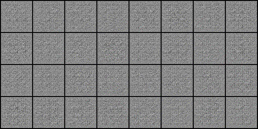

# DCGAN
## Introduction

Implement DCGAN from scratch using Pytorch.

## Usage
1. Clone this repository
```
git clone https://github.com/tien02/Implement-DCGAN.git
```
2. Create virtual environment (venv), then activate it.
```
python -m venv your_venv
```
3. Install dependencies
```
pip install -r requirements.txt
```
4. Run training process, use `--help` for more details
```
python train.py [-h]
                [--datapath] path/to/your/dataset
                [--checkpoint] path/to/your/checkpoint
                [--save] 
                [--tensorboard]
                [--make_gif]
```
Use `--save` to save checkpoint after training.

Use `--tensorboard` to activate tensorboard in order to see the training process.

Use `--make_gif` to make create .gif image file about generation process after training.

## Result

- Result on MNIST dataset:



## Notice

- Edit config.py for your own purpose.

- GAN is really sensitive to hyperparameters, be hesitate before tuning.

## References 
- Paper:
  - [Generative Adversarial Nets](https://arxiv.org/pdf/1406.2661.pdf)
  - [Unsupervised Representation Learning with Deep Convolutional Generative Adversarial Networks](https://arxiv.org/pdf/1511.06434.pdf)
- YouTube: [Aladdin Persson](https://www.youtube.com/watch?v=IZtv9s_Wx9I)
